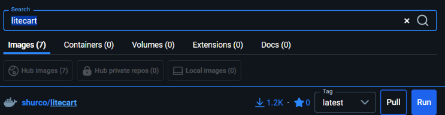
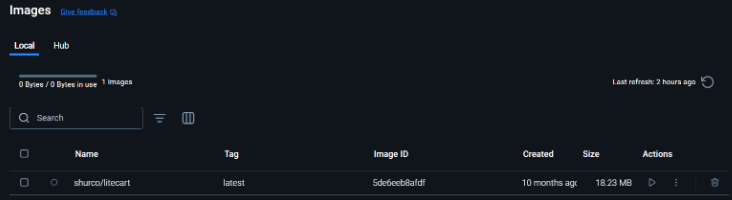
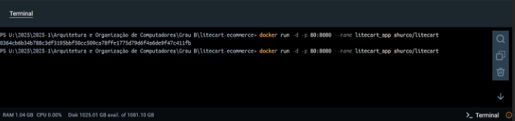

Como configurar o ambiente de desenvolvimento 

- Acesse o Docker Desktop; 
- Pesquise “litecart” na aba de pesquisa; 
- Escolha a opção “shurco/litecart”: 

- Escolha a opção “Run”; 
- Com isso feito, a imagem foi baixada:

- Vá no terminal do docker e cole este comando: 

docker run -d -p 80:8080 --name litecart_app shurco/litecart 

- Agora, basta ir em “Containers” e verificar que o container já está no ar; 
- Acesse no seu computador os endereços:

Loja (interface do cliente): 
 http://localhost:8080 

Tempo de Inicialização 
Comando executado: Measure-Command { docker run -d -p 80:8080 --name litecart_test shurco/litecart } 

Utilização de CPU e RAM 
Comando executado: docker stats --no-stream > resources.csv 

Throughput de Disco (I/O) 
Comando executado - PREPARAÇÃO: docker run --rm -v sysbenchdata:/data -w /data severalnines/sysbench sysbench fileio --file-total-size=1G --file-test-mode=rndrw prepare 

Comando executado - EXECUÇÃO: docker run --rm -v sysbenchdata:/data -w /data severalnines/sysbench sysbench fileio --file-total-size=1G --file-test-mode=rndrw run 

Densindade
Comando executado - PREPARE: docker run --rm -v sysbenchdata:/data -w /data severalnines/sysbench ` 

Comando executado – EXECUTAR: 

for ($i=1; $i -le 5; $i++) { 
    docker run -d --name litecart_$i -p (8080 + $i):80 shurco/litecart 
    Start-Sleep -Seconds 5 
    Write-Host "Executando benchmark com $i container(es)..." 
    docker run --rm -v sysbenchdata:/data -w /data severalnines/sysbench ` 
    sysbench fileio --file-total-size=1G --file-test-mode=rndrw --time=30 run 
}

Tempo de Resposta (wrk)

Teste 1: 100 Conexões Simultâneas 
Comando executado: docker run --rm --add-host=host.docker.internal:host-gateway williamyeh/wrk -t10 -c100 -d30s http://host.docker.internal:80

Teste 2: 30 Conexões Simultâneas 
Comando executados: docker run --rm --add-host=host.docker.internal:host-gateway williamyeh/wrk -t10 -c30 -d30s http://host.docker.internal:80 

Teste 3: 70 Conexões Simultâneas 
Comando executado: docker run --rm --add-host=host.docker.internal:host-gateway williamyeh/wrk -t10 -c70 -d30s http://host.docker.internal:80 